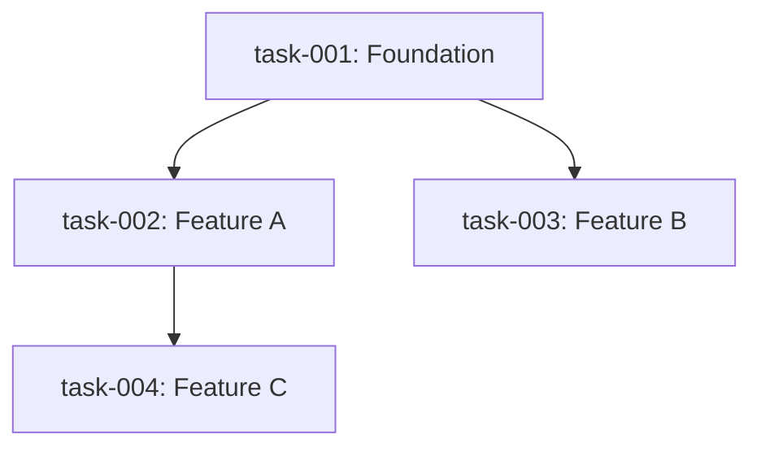

# PRD Task Splitter

Decompose a PRD (or similar requirements doc) into individual `task-XXX.md` files, each
representing one well-scoped unit of work, with explicit dependency labels so teams know
the safe order of execution.

---

## Core Concepts

### Decomposition Hierarchy

Follow a three-level breakdown:

```
PRD
└── Epics (major feature areas, e.g. "Data Layer", "Auth", "UI")
    └── User Stories (one user-facing capability per story)
        └── Tasks (one shippable unit of work per file)
```

Each **task file** = one story or a meaningful sub-story. Tasks should be:
- **Independent** where possible (can be reviewed/merged on its own)
- **Vertical slices** (touches all layers needed to deliver the behavior)
- **Estimable** (a developer can size it without ambiguity)
- **Testable** (has clear acceptance criteria)

Use the **INVEST criteria** as a quality check per task:
- **I**ndependent – minimal coupling to other in-progress tasks
- **N**egotiable – scope can be adjusted without breaking the task
- **V**aluable – delivers something observable to a user or system
- **E**stimable – dev can give a rough size
- **S**mall – completable in 1–3 days ideally, 5 days max
- **T**estable – acceptance criteria are verifiable

---

## Task Lifecycle

Every task has a `status` field tracked **only in `_index.md`** (not in individual task files, which stay clean as spec documents).

### Status Values

| Status | Meaning |
|--------|---------|
| `todo` | Not started. Default on generation. |
| `in_progress` | Actively being worked. Only one task per wave should be in this state at a time unless parallel_safe. |
| `done` | Work finished **and** manually confirmed by the user. Agent never sets this — only the user does. |

### Lifecycle Rules

1. **Only `todo` → `in_progress`** when the user says "pick", "start", or "work on" a task.
2. **Guard: a task can only be picked if all its `depends_on` tasks are `done`.**  
   If a dependency is not `done`, refuse and tell the user which tasks need to finish first.
3. **`in_progress` → `done`** only when the user explicitly confirms (e.g. "mark task-003 as done", "it's approved", "looks good, finish it").  
   The agent should never self-promote a task to `done` — it only proposes readiness.
4. **`done` → `in_progress`** is allowed if the user asks for rework after review.
5. When a task is marked `done`, immediately tell the user which tasks just became available to pick next (i.e. tasks whose dependencies are now all `done`).

### Status Commands to Recognize

| User says | Action |
|-----------|--------|
| "pick task-003" / "start task-003" / "work on task-003" | Validate dependencies → set `in_progress` in `_index.md` |
| "what can I work on next?" / "what's available?" | List all `todo` tasks whose `depends_on` are all `done` |
| "mark task-003 as done" / "task-003 is done" / "finish task-003" | Set `done` in `_index.md`, announce newly unblocked tasks |
| "task-003 needs rework" / "reopen task-003" | Set back to `in_progress` |
| "show status" / "what's the current status?" | Print the Task Summary table from `_index.md` |

### Updating `_index.md`

When any status changes, edit **only** the `Status` column in the Task Summary table in `_index.md`. Do not touch the task file itself.

Status should be rendered with an emoji badge for quick scanning:

| Status | Badge |
|--------|-------|
| `todo` | `⬜ todo` |
| `in_progress` | `🔵 in_progress` |
| `done` | `✅ done` |

---

## Step-by-Step Process

### Step 1: Analyze the PRD

Read the entire PRD. Extract:
1. **Goal/purpose** of the product
2. **User stories or functional requirements** listed
3. **Technical constraints** (stack, libraries, data model)
4. **Non-goals** (explicitly out of scope)
5. **Open questions** (flag these, don't silently skip)

### Step 2: Identify Epics

Group related requirements into 3–7 epics. Name them by layer or domain. Examples:
- `data-layer` — schema, storage, migrations
- `goal-management` — CRUD for goals
- `logging` — recording daily entries
- `stats` — charts and aggregations
- `navigation` — routing and layout

### Step 3: Decompose into Tasks

For each epic, derive tasks. Rules:
- One task = one PR's worth of work
- Each task must have a title, goal, and acceptance criteria
- Prefer vertical slices over horizontal layers (don't make "add all DB models" one task and "add all UI" another — ship one feature end-to-end per task)
- Exception: a **foundation task** (data model, routing scaffold, shared layout) is a legitimate horizontal slice when everything else depends on it

### Step 4: Map Dependencies

For each task, determine:
- **`depends_on: []`** — task IDs that MUST be merged before this one can start
- **`parallel_safe: true/false`** — can it be worked in parallel with its siblings?

Dependency types to consider:
| Type | Meaning | Example |
|------|---------|---------|
| **Finish-to-Start** (most common) | Task B cannot start until Task A is done | UI form can't be built until DB schema exists |
| **Shared foundation** | Multiple tasks all need the same base | All features need routing scaffold |
| **Data contract** | Task B consumes an interface Task A defines | Stats chart needs log query API |

Avoid over-constraining: only mark a real dependency, not a preferred order.

### Step 5: Compute Execution Waves

Group tasks into waves (parallel batches):
- **Wave 1** — tasks with no dependencies (foundation, scaffold)
- **Wave 2** — tasks that depend only on Wave 1
- **Wave N** — tasks whose all dependencies are in earlier waves

Label each task with its wave number.

### Step 6: Write Task Files

Create one `task-XXX.md` file per task (zero-padded, e.g. `task-001.md`).

---

## Task File Template

```markdown
---
id: task-XXX
title: <Short imperative title>
epic: <epic-name>
wave: <1 | 2 | 3 ...>
depends_on: [task-YYY, task-ZZZ]   # empty list [] if none
parallel_safe: true                 # true = can run alongside wave siblings
estimate: <XS | S | M | L>         # XS=<1d, S=1d, M=2-3d, L=4-5d
---

## Goal

One sentence: what does this task deliver and why does it matter?

## Background / Context

What the implementer needs to know: relevant PRD sections, design decisions,
constraints, or prior art. Keep it brief — link to the PRD rather than duplicating it.

## Acceptance Criteria

- [ ] Criterion 1 (observable behavior, not implementation detail)
- [ ] Criterion 2
- [ ] Criterion 3
- [ ] TypeScript/lint passes (if applicable)
- [ ] Unit or integration test covers the happy path

## Technical Notes

Optional. Implementation hints, specific APIs, library calls, schema fields, or
edge cases the dev should know about. Not prescriptive — dev can deviate if justified.

## Out of Scope

Explicit list of things NOT in this task (avoid scope creep).

## Dependencies Detail

| Depends On | Why |
|------------|-----|
| task-YYY | Needs the DB schema this task defines |

## Open Questions

- Any ambiguity from the PRD that should be resolved before or during this task.
```

---

## Output Structure

Produce files in a `tasks/` directory:

```
tasks/
├── _index.md          ← dependency summary table + wave diagram
├── task-001.md
├── task-002.md
├── task-003.md
└── ...
```

### `_index.md` Template

```markdown
# Task Index

## Dependency Graph (Mermaid)



## Execution Waves

| Wave | Tasks | Can run in parallel? |
|------|-------|----------------------|
| 1 | task-001 | — (single task) |
| 2 | task-002, task-003 | ✅ Yes |
| 3 | task-004 | Depends on task-002 only |

## Task Summary

| ID | Title | Epic | Wave | Depends On | Estimate | Status |
|----|-------|------|------|------------|----------|--------|
| task-001 | ... | data-layer | 1 | — | S | ⬜ todo |
| task-002 | ... | goal-management | 2 | task-001 | M | ⬜ todo |
| ... | | | | | | |

> **How to use:** Tell the agent "pick task-001" to start a task, or "mark task-001 as done"
> once it passes your review. The agent will enforce dependency order and update this table.

## Open Questions (from PRD)

Unresolved PRD questions that affect task scope. Flag for product owner.
```

---

## Dependency Label Rules

Use these labels consistently in each task's frontmatter:

```yaml
depends_on: [task-001]          # list of task IDs (not titles)
parallel_safe: true             # can this run alongside its wave siblings?
blocks: [task-005, task-006]    # optional: which tasks are waiting on this one
```

If a task is standalone (Wave 1), write:
```yaml
depends_on: []
parallel_safe: true
```

---

## Sizing Guide

| Label | Duration | What fits |
|-------|----------|-----------|
| XS | < 1 day | Schema migration, add a field, wire a simple toggle |
| S | ~1 day | One CRUD endpoint + basic UI |
| M | 2–3 days | Feature with business logic + UI + test |
| L | 4–5 days | Complex feature with multiple states, charts, scheduling logic |

If a task feels XL (> 5 days), split it further.

---

## Quality Checklist (before finishing)

Run through this before delivering the files:

- [ ] Every PRD user story maps to at least one task
- [ ] No task is larger than L (5 days) — split if needed
- [ ] All `depends_on` references point to real task IDs
- [ ] No circular dependencies (A→B→A)
- [ ] Wave 1 contains only truly foundational tasks
- [ ] Parallel-safe tasks in the same wave don't share mutable state
- [ ] Each task has at least 2 acceptance criteria
- [ ] `_index.md` Mermaid diagram accurately reflects all edges
- [ ] Non-goals from the PRD are called out in relevant tasks' "Out of Scope"
- [ ] Open questions from the PRD are surfaced in `_index.md`
- [ ] Every task in the Task Summary table has `⬜ todo` as initial status
- [ ] The usage hint below the Task Summary table is present in `_index.md`

---

## Example: Minimal 3-Task Decomposition

Given a PRD with one feature:

```
task-001: Setup DB schema          (Wave 1, no deps)
task-002: Build CRUD API           (Wave 2, depends on task-001)
task-003: Build UI form            (Wave 2, depends on task-001, parallel with task-002)
task-004: Wire UI to API + e2e     (Wave 3, depends on task-002 AND task-003)
```

Dependency graph:
```
task-001
├── task-002 ─┐
└── task-003 ─┴── task-004
```

task-002 and task-003 can be worked simultaneously by different developers once task-001 is merged.

---

## Notes on Special PRD Patterns

**One-time vs. repetitive goals**: When PRD distinguishes between goal types, create separate tasks for the scheduling/logic variation rather than combining them into one large task.

**Non-functional requirements** (performance, responsive layout): Attach these as acceptance criteria to the feature task they belong to, or create a dedicated task if they require significant standalone work (e.g., "add mobile navigation layout").

**Open questions in PRD**: Do not silently resolve them. List them in `_index.md` and note which tasks are blocked or may need rework pending the answer.