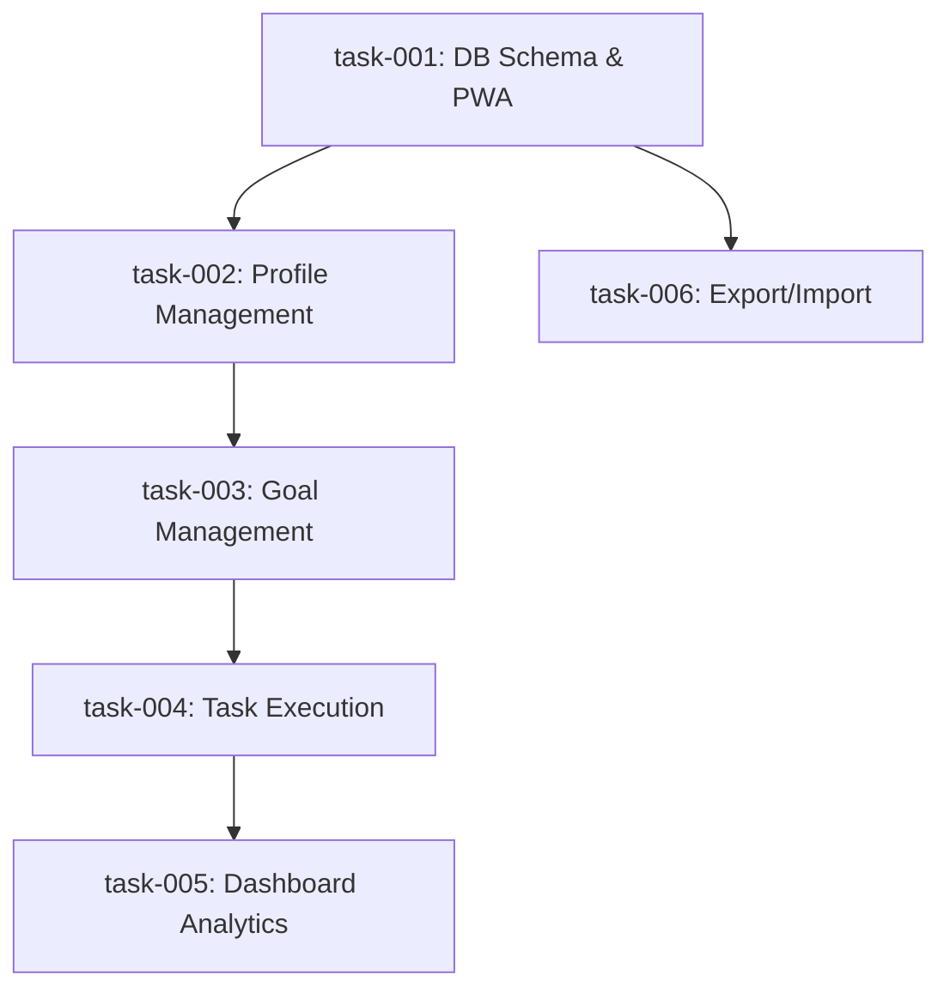

# Task Index

## Dependency Graph

## Execution Waves

| Wave | Tasks | Parallel? |
|------|-------|-----------|
| 1 | task-001 | — |
| 2 | task-002, task-006 | ✅ Yes |
| 3 | task-003 | Depends on task-002 only |
| 4 | task-004 | Depends on task-003 only |
| 5 | task-005 | Depends on task-004 only |

## Task Summary

| ID | Title | Epic | Wave | Depends On | Estimate | Status |
|----|-------|------|------|------------|----------|--------|
| task-001 | Setup Dexie Database Schema and PWA Manifest | data-layer | 1 | — | S | 🔵 in_progress |
| task-002 | Profile Management and UI Shell | profile-management | 2 | task-001 | M | ⬜ todo |
| task-006 | Data Export and Import Synchronization | sync | 2 | task-001 | S | ⬜ todo |
| task-003 | Goal Template Management | goal-management | 3 | task-002 | M | ⬜ todo |
| task-004 | Task Generation and Rating Execution | task-execution | 4 | task-003 | L | ⬜ todo |
| task-005 | Dashboard Analytics | stats-dashboard | 5 | task-004 | M | ⬜ todo |

> **How to use:** Say "pick task-001" to start a task, or "mark task-001 as done"
> once it passes review. The agent enforces dependency order and updates this table.

## Open Questions (from PRD)
- Should the current streak be calculated per profile globally, or per individual goal? (Defaulting to global per profile for now).
- How should missed tasks be handled in the performance trend chart? (Recorded as unrated/ignored for average rating, but affects completion rate).
