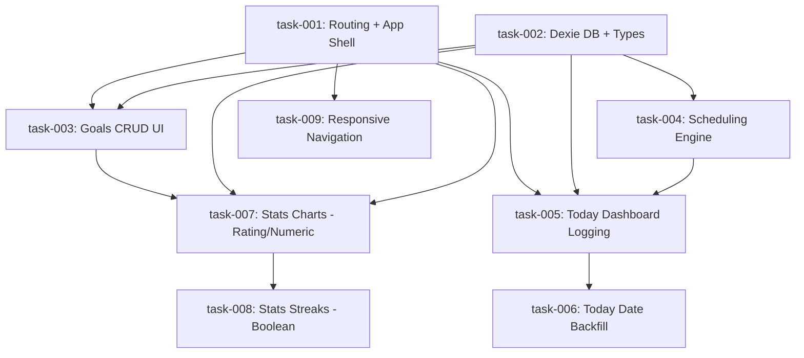

# Task Index — Behavior Tracker

Source PRD: `tasks/prd-behavior-tracker.md`

## Dependency Graph (Mermaid)

## Execution Waves

| Wave | Tasks                        | Can run in parallel? |
| ---- | ---------------------------- | -------------------- |
| 1    | task-001, task-002           | ✅ Yes                |
| 2    | task-003, task-004, task-009 | ✅ Yes                |
| 3    | task-005                     | —                    |
| 4    | task-006, task-007           | ✅ Yes                |
| 5    | task-008                     | —                    |

## Task Summary

| ID       | Title                         | Epic            | Wave | Depends On                   | Estimate |
| -------- | ----------------------------- | --------------- | ---- | ---------------------------- | -------- |
| task-001 | Routing + app shell           | navigation      | 1    | —                            | S        |
| task-002 | Dexie DB + types              | data-layer      | 1    | —                            | M        |
| task-003 | Goals CRUD UI                 | goal-management | 2    | task-001, task-002           | L        |
| task-004 | Scheduling engine             | scheduling      | 2    | task-002                     | M        |
| task-005 | Today dashboard logging       | logging         | 3    | task-001, task-002, task-004 | L        |
| task-006 | Today date backfill           | logging         | 4    | task-005                     | S        |
| task-007 | Stats charts (rating/numeric) | stats           | 4    | task-001, task-002, task-003 | M        |
| task-008 | Stats streaks (boolean)       | stats           | 5    | task-007                     | S        |
| task-009 | Responsive navigation         | navigation      | 2    | task-001                     | S        |

## Open Questions (from PRD)

- Monthly schedules: support “last day of month” as an option?
  - Affects: task-004, task-005
- One-time goals: appear on “Today” only until deadline, or only on the deadline date?
  - Affects: task-004, task-005
- Goals: support paused/archived state to stop tracking without deleting history?
  - Affects: task-003, task-004, task-005, task-007

